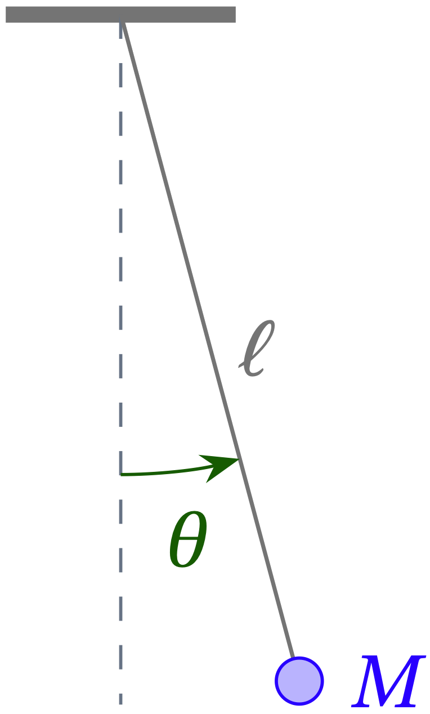

# Background

You studied the simple pendulum in Physics 24 or Physics 24A, but you may need a quick refresher. We'll go lightly over the theory and then also offer some information about local gravity.

## Theory

The simple pendulum is an example of a system with a stable equilibrium state.  When the string is perfectly vertical and the system is at rest, we call this **equilibrium** because a pendulum starting out in this state will stay in it.  It is also a **stable** equilibrium, because a pendulum nudged over just a little from this state will **oscillate** around it, rather than flying off to some totally different configuration.  The oscillation of a simple pendulum has numerous direct applications, most notably as an excellent clock, but it also provides a reassuringly concrete analogy for many other systems which oscillate about their stable equilibrium states.  

  

**Figure 1** --- A simple pendulum consists of a point mass suspended by an inextensible and massless string from a fixed point in a gravitational field.

As shown in Fig. 1, a simple pendulum consists of a point mass $$M$$ suspended from a frictionless pivot by a string of fixed length $$\ell$$ and negligible mass. The pendulum is released from rest at initial angle $$\theta_0$$ from the vertical and, in the absence of air resistance, oscillates back and forth with amplitude $$\theta_0$$. The time for one complete cycle of the oscillation is called the period, $$T$$.

You can work out how the period depends on $$\ell$$ using dimensional analysis (which yields a proportionality), or by applying Newton's laws (which gives an expression for small-amplitude motion). Let $$\theta$$ be the angle the string makes with the vertical. Then the equation of motion for the mass of the bob that you can derive from a free body diagram is
\begin{equation}\label{eq:pendulum}
  \ddot{\theta} + \frac{g}{\ell} \sin\theta = 0
\end{equation}
For small-amplitude motion, $$\sin\theta \approx \theta$$, yielding the simpler equation
\begin{equation}\label{eq:SHO}
  \ddot{\theta} + \frac{g}{\ell} \theta = 0
\end{equation}
with solutions of the form
\begin{equation}\label{eq:pend-sol}
  \theta(t) = \theta_0 \cos(\omega t)
\end{equation}
where 
\begin{equation}\label{eq:omega}
  \omega = \sqrt{g/\ell}
\end{equation}
and we have assumed that the bob is released from rest at $$t = 0$$ with $$\theta = \theta_0$$.
Since the period is the time it takes the pendulum to complete one oscillation, it is the time required for the argument of the cosine in Eq. \eqref{eq:pend-sol} to change by $$2\pi$$. Therefore,
\begin{equation}\label{eq:period}
  2 \pi = \omega T \qquad\text{or}\qquad
  \boxed{T = 2 \pi \sqrt{\frac{\ell}{g}}}
\end{equation}

## Earth's gravitational field

If the Earth were a perfect sphere (with a spherically symmetric distribution of mass)---and if it were not rotating---then the acceleration of gravity would only depend on how far one is from the center of the Earth. However, the Earth *is* rotating, which reduces the effective strength of local gravity the closer we are to the Equator, and it is not a perfect sphere, which means that there is some dependence of $$g$$ on latitude $$\lambda$$. 

You can request an accurate estimate of local gravity by entering local latitude, longitude, and height above mean sea level at the [NOAA gravitation calculator](https://geodesy.noaa.gov/cgi-bin/grav_pdx.prl){:target="_blank"}. You can figure these out using standard apps on your smartphone or by Googling a bit. Warning: *the NOAA site is picky about the numerical format you use. I find it easiest to use decimal degrees and to make sure I put a decimal point in the elevation value.*

In honor of Galileo Galilei, the result is reported in milli**gals**, where 1 gal is 1 cm/s2, so you should multiply the result given in milligals by $$10^{-5}$$ to convert to m/s2.