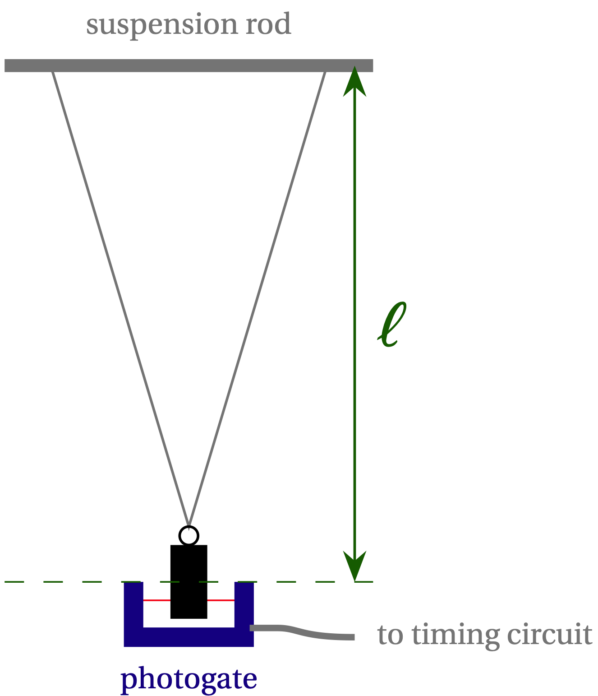

# Week 1

--------------
1. [Preface](#preface)
2. [Background Reading](#background-reading)
3. [Formulating a Hypothesis](#formulating-a-hypothesis)
4. [Instrumentation](#instrumentation)
5. [Exploratory Measurements](#exploratory-measurements) 
6. [Reproducibility](#reproducibility)

--------------

  

**Figure 1** --- Schematic of the pendulum and timing photogate. The passage of the bob through the photogate interrupts a light beam (shown in red), which triggers the timing circuit.

Your experimental setup consists of a cylindrical pendulum "bob" suspended by a nylon monofilament line, as illustrated in Fig. 1. Note that the effective length $$\ell$$ of the pendulum is not the length of the nylon line, but the perpendicular distance from the axis of suspension to the center of mass of the bob.

At your station you will find an accurate and precise (*how* accurate and *how* precise?) digital timer for measuring the period and various tools
for measuring lengths and angles.  You will be able to change the pendulum
length and the pendulum bob mass.  Be sure to familiarize yourself with the
apparatus by playing with it *carefully and observantly* for a few minutes. 
Verify that the timer circuit measures one full period of the pendulum, and
learn how to read the display.  Get a rough idea of how sensitive the period is to changes in mass, length, and amplitude, and how sensitively you can adjust each quantity.  Be sure to keep records in your lab book of your observations, complete with sketches where appropriate. [**NOTE**:  *When releasing the pendulum bob, take care not to let it hit the timing gate!*]

## Mini-modules

I should have a section on how the mini-modules work. It should mention that students can change the count rate to achieve greater resolution.

## Week 1

Want them to start with dependence on amplitude. In Week 2, they can look at length dependence (and possibly mass). The final deliverable ought to be (a) a plot of the amplitude dependence for a fixed (long) value of $$\ell$$. (b) a plot and fit to the length dependence from which they deduce a value for local $$g$$. They should be plotting as they take data in Google Sheets. Maybe I can explore using Python rather than Matlab for plotting/fitting.

-----------------------

In the Exploratory Phase it can be especially important to take detailed notes. Organizing a digital lab notebook and data spreadsheet can be tricky, so for Week 1 we are providing a [template for you to follow along with that we've assigned from Google Classroom](https://classroom.google.com/u/0/w/MzY5MzA2OTcxNzM4/t/all){:target="_blank"}. 

**Make sure you have this spreadsheet and your Module 1 Lab Notebook handy as you go through the content on this Week 1 page. Remember: you are required to use the provided spreadsheet/lab notebook.**

## Preface
If you have any questions outside of class, we encourage you to reach out to your classmates through the class Piazza site or come to office hours to talk to an instructor. [You can sign up for the class Piazza site here.](https://piazza.com/hmc/fall2021/ph50)

Before diving into data collection and analysis we would like to set some expectations. This course centers around the collection, analysis, and communication of experimental data and results. We expect all of these to be conducted with care and integrity.

Collaboration:
We expect every student to perform the data analysis, miniquestions, checkpoints, and deliverables for themselves, but you are welcome to discuss your results and analysis with your lab partner and classmates.

To make sure we all start on the same page please answer the following mini-questions (mini-questions will appear throughout this manual and are required to be completed before you arrive in lab each week. Please see the syllabus for more information regarding mini-questions) - mini-questions are interspersed throughout the lab manual and need to be completed before the start of lab.

--------------------

#### Miniquestion: Acceptable forms of collaboration
*[Click here to open in a new tab](https://docs.google.com/forms/d/e/1FAIpQLSc1cnV36goAOx-2CoKGTioDpyajLhYshON1zceV19wu0WG5wQ/viewform){:target="_blank"}*

<iframe src="https://docs.google.com/forms/d/e/1FAIpQLSc1cnV36goAOx-2CoKGTioDpyajLhYshON1zceV19wu0WG5wQ/viewform?embedded=true" width="640" height="300" frameborder="0" marginheight="0" marginwidth="0">Loading…
</iframe>

------------------------------

Data Collection:
Please make sure you read the tips for electronic lab notebooks in the syllabus. We emphasize that your notebook is a record of the experiment. Deleting experimental data from a lab notebook is never acceptable. However, it is acceptable to remeasure/reanalyze data because of inaccurate or incorrect initial efforts. This includes recollecting data with an improved experimental procedure. An example of an acceptable procedure would be: 

You are trying to time how fast your little brother can run. Initially you do this in your hallway but you realize you are getting inaccurate results. You take him to a track and restart the experiment in a way that is less sensitive to the initial conditions. You make a note next to the data you collected with a procedure you believe to be less reliable and then focus on the newly collected data in your analysis, but you do not delete the original data from your lab notebook.

--------

#### Miniquestion: Handling data
*[Click here to open in a new tab](https://forms.gle/vuCCDuDNYRaWeC7e6){:target="_blank"}*

<iframe src="https://docs.google.com/forms/d/e/1FAIpQLSeAKMIHuPP0wX4WZKX78GnCsjuOFV63meAfYjctYu1r6kWlMg/viewform?embedded=true" width="640" height="300" frameborder="0" marginheight="0" marginwidth="0">Loading…
</iframe>

------------------------------

You may find yourself in a situation where it isn't as clear what is acceptable. When in doubt please ask. 

## Background Reading

Often the first step is to do some background reading and theoretical analysis. We are measuring the coefficient of static friction, a dimensionless number that depends on the two surfaces in contact. This video from Prof. Arlett on how $$\mu_s$$ and $$\theta_c$$ are related will provide some background and a quick refresher:
{:target="_blank"} 

In your lab notebook, try the derivation yourself and document the result.

## Formulating a Hypothesis

We can now try to think of a hypothesis we can test with an experiment. As a quick check, according to the theory, which factors will affect a measurement of $$\theta_c$$?

#### Miniquestion: Critical Angle Factors
[*Click here to open in a new tab*](https://forms.gle/oUrvxpsg5foNjnVH7){:target="_blank"}

<iframe src="https://docs.google.com/forms/d/e/1FAIpQLSfFH6ZBvZzAlN_LNJQqnmFCPN97KyLGW44mU-AsTd_XSAxcTw/viewform?embedded=true" width="640" height="300" frameborder="0" marginheight="0" marginwidth="0">Loading…
</iframe>

-----

Based on this answer, can you think of any hypotheses you could try to test? 

**While there are many different hypotheses you might consider, for Module 1 we will all test the same hypothesis. The hypothesis we will test is:**

*"The coefficient of static friction between two surfaces as measured by the critical angle at which an object slips is independent of the mass of the sliding object."*

## Instrumentation

Now that we've decided what hypothesis we are going to test, we need to figure out what equipment and experimental tools we are going to use. For this module, a ramp, container, and different masses that can be placed in the container will be provided at your lab bench. 

To measure the angle you will use your phone and the **Phyphox** App. Please go to [phyphox.org](https://phyphox.org){:target="_blank"} (or to the app store on your device) and download the phyphox app. Try to do this before you come to class for the first day of lab. After downloading, find the "Inclination" tool and test that it works correctly with your phone.

Make note of your equipment in your lab notebook (record keeping is important) and record any other notes you think might be helpful if someone else was trying to replicate your setup. Remember: for the praciticum you will only have access to your Google-classroom-assigned lab notebook and data sheet.

## Exploratory Measurements

The exploratory measurements can be a fun part of the experimental process. You get to play around with your setup and make some observations! You can really let your curiosity and creativity guide you in this part of the experimental process. 

For your exploratory measurements in Module 1, we would like you to do the following:

+ Perform a single measurement to check that you are getting a reasonable answer

+ Get an understanding of the repeatability of your measurement 

+ Check other factors that might affect your measurement and its reproducibility (this is where you get to play!)

The steps below guide you through these three items, and provide links to important concepts (so please follow along carefully). Make sure you are recording your exploratory observations as you go so that you have a record of them (reminder: we have set up [a spreadsheet for you on Google Classroom](https://classroom.google.com/c/MjUxNTgyMzY1MDM5/a/MjUxNTgyMzY1MDQ5/details){:target="_blank"}, use the "Exploratory Observations" tab to record your data in this section).

## Estimating Uncertainty

The "Uncertainty Introduction" has information we are going to need in Ph50 about treating sources of experimental uncertainty. Please first read both the [overview on uncertainties](uncertainty-introduction#overview){:target="_blank"} and also about [resolution uncertainty](uncertainty-introduction#resolution-uncertainty){:target="_blank"} ($$\approx$$ 5 minutes).  This is a more extended guide from which we took the excerpt provided last week.

#### In lab: Perform a Single Measurement

Usually one of the first exploratory steps is to use your equipment to take a single measurement. We want to make sure that our measurement (in this case, $$\theta_c$$) will lead to a reasonable value of the calculated quantity we are trying to obtain ($$\mu_s$$). We also want to get a sense of the resolution of our measurement device and how that will affect the uncertainty measured in the calculated quantity. 

+ Place the block on the ramp and slowly raise the ramp while keeping an eye on the plane inclination measurement on the phyphox app. Record in the spreadsheet the value of the angle you observe just before slipping (in other words, perform a single measurement of $$\theta_c$$).

    Record the resolution uncertainty for the critical angle $$\delta_\mathrm{res} \theta_c$$ in your exploratory observations spreadsheet.

| $$\theta_c$$ (degrees) | $$\delta_\mathrm{res} \theta_c $$ (degrees) |
|:-----------------------:|:---------------------------------------------:|
 | ...            |   ... |

+ Calculate $$\mu_s$$ from your single measurement of $$\theta_c$$ (using the relationship derived in the [background reading](#background-reading)). 

*Friendly reminder: convert the angle from degrees to radians in your Google Sheet calculation. **You also need to convert your uncertainty in the angle from degrees to radians in the same manner**.*

### Combining Uncertainties

When you make a measurement you will have both random and resolution (sometimes multiple!) uncertainties. In order to obtain one actual uncertainty to quote in your value you can combine the sources by adding in quadrature. Adding in quadrature means to square each value for your uncertainty, add them all together, and take the square root of the sum,
$$ \delta x_\mathrm{total} = \sqrt{\delta x_1^2 + \delta x_2^2 + \delta x_3^2 + \cdots}$$
where $$\delta x_\mathrm{total}$$ is the total uncertainty in the measured value $$x$$ and $$\delta x_1$$,$$\delta x_2$$,$$\delta x_3$$,… are the various sources of uncertainty in the measurement of $$x$$ (e.g. random uncertainty, resolution uncertainty, etc).

**When combining different sources of uncertainty make sure they have the same units**

Remember: Systematic errors should be dealt with separately, by eliminating all you possibly can and estimating the size of remaining shifts, in addition to pinpointing the specific effect they would have on the final analysis.  (Would they make the value you measure too large? Would they make a linear graph look quadratic? etc.)

## Propogating Uncertainties
+ Learn how to propagate uncertainties from this video of Prof. Gerbode explaining how to propagate uncertainty in $$\theta_c$$ to uncertainty in $$\mu_s$$ and answer the mini-question below

{:target="_blank"}

--------

#### Miniquestion: Uncertainty Propagation
*[Click here to open in a new tab](https://docs.google.com/forms/d/e/1FAIpQLSdGBpAsDmSC8Ndwu0ksH5ViBPUN4lclLMx04Tl8R2vVia4pQw/viewform?){:target="_blank"}*

<iframe src="https://docs.google.com/forms/d/e/1FAIpQLSdGBpAsDmSC8Ndwu0ksH5ViBPUN4lclLMx04Tl8R2vVia4pQw/viewform?embedded=true" width="640" height="303" frameborder="0" marginheight="0" marginwidth="0">Loading…
</iframe>

------------------------------

You can get some additional practice propogating uncertainty [here](uncertainty-introduction#extra-practice)

## Propogation of Your Experimental Uncertainty

After watching the video from Prof. Gerbode, let's return to your measurement of $$\mu_s$$ from $$\theta_c$$:

+  Calculate the resolution uncertainty in measuring the coefficient of static friction $$\delta_\mathrm{res} \mu_s$$ by propagating your uncertainty $$\delta_\mathrm{res} \theta_c$$. Derive any formulas you use in your lab notebook.

| $$\mu_s$$  | $$\delta_\mathrm{res} \mu_s $$ |
|:-----------------------:|:---------------------------------------------:|
 | ...            |   ... |

Comment on whether your measured value is reasonable (e.g. is $$\mu_s$$ within the limits of allowable values, i.e. between 0 and infinity?  With a quick google search, is it similar to $$\mu_s$$ for similar surfaces? Is your fractional resolution uncertainty reasonably small,  (fractional resolution uncertainty $$\equiv \frac{\delta_\mathrm{res} \mu_s}{\mu_s} \ll 1$$)? In other words, confirm that the uncertainty in $$\mu_s$$ less than the value of $$\mu_s$$ itself?

At this point, if your answer were to be unreasonable or you were unable to calculate the quantity you are interested in testing (in our case $$\mu_s$$), then it would be a good idea to carefully rethink your measurement. Doing this initial single measurement and check can save a lot of time, especially when the experimental setup gets more complicated as it will later in the course. If you're unsure, speak to your instructor.

Let's double-check your procedure. Using the exact same method that you set up to calculate your $$\mu_s$$  and  $$\delta_\mathrm{res} \mu_s $$ above, complete the following miniquestion with an example measurement of $$\theta_c$$:

#### Miniquestion: Calculating coefficient of static friction and resolution uncertainty
[*Click here to open in a new tab*](https://forms.gle/mvteqnKeZNQXDytZ9){:target="_blank"}

<iframe src="https://docs.google.com/forms/d/e/1FAIpQLSdKSGfERWII08uU0DZio3Wtcul85SiBFLkbG44IAQgMJg4hMg/viewform?embedded=true" width="640" height="300" frameborder="0" marginheight="0" marginwidth="0">Loading…
</iframe>

## Reproducibility

So far we've focused on the resolution uncertainty. But is that really a good estimate of the uncertainty of your measurement? 

Read [this discussion about random uncertainty](uncertainty-introduction#random-uncertainty) 

The goal of testing repeatability is to get a sense of the random error associated with the measurement. 

Take a few (maybe five) measurements of $$\theta_c$$ under identical conditions. Make sure you "reset" your experimental setup each time: start the ramp from a horizontal position ($$\theta = 0$$), place the block onto the ramp, and then slowly start to raise the ramp. "Resetting" the experimental setup between trials helps to randomize systematic error as discussed in Module 0.

Trial #	| $$\theta_c$$ (degrees)	
|:-------:|:-------------------------:|	
1 |			
2	|		
3	|		
4	|		

Using the information provided in the [discussion on random undertainty](uncertainty-introduction#random-uncertainty), calculate the standard error of the mean for your data.

+ How does the standard error in your data compare to the resolution uncertainty? 
    + Based on this, what should we focus on: improving our instrumentation (reducing resolution uncertainty) or reducing our random uncertainty?
    
Reducing random uncertainty can include both improving our measurement technique to reduce the spread in our data and  taking many repeated trials. It is often helpful to do both. This is also your chance to take some initiative. The approach you use to measure the angle at which the container begins to slip will significantly affect the reproducibility. Materials will be provided at the back of the lab to allow you to raise the ramp in different ways. You should give some consideration to how to reliably determine the critical angle - trying to press a button on your phone as the container is starting to move while holding the ramp is unlikely to yield reproducible results. Use the remaining time to explore techniques that might help you to get more reproducibile results. If you aren't sure where to start talk to your instructor. Some ideas to consider - you may find equipment at the back of the lab that allows you to raise the ramp in a more controlable way (e.g. you will find equipment that you could use to construct a pulley system), you may also find it helpful to know that Phyphox will record the data for later extraction. If you know the critical angle was the highest angle reached you don't need to press any buttons on the phone during the experiment. Designing/setting up the experiment in a way that will allow you to get reproducible results is a critical part of the experimental process and of this course. 

-------------
## What you need to leave lab with:

+ You should have a procedure for collecting data in which you have made an effort to improve the reproducibility of your measurements. This is an important first step to being able to test our hypothesis next week.

+ You should have a set of 5 data points -  all collected with the same mass in the container, using the procedure you settled on to improve reproducibility. This is the data you will use when completing the checkpoint.
 
## Checkpoint 1

+ [Submit Module 1 checkpoint 1 on Gradescope](https://www.gradescope.com/courses/282675/assignments/1392670){:target="_blank"}. 

    - The Gradescope assignment includes a sample calculation to ensure you are calculating $$\mu_s$$ and propogating the uncertainty correctly. The sample calculation will provide real time feedback. This is to ensure you know how to do the calculation before analyzing your data. It is not an honor code violation to make changes after receiving the feedback before submission.

    - You will be asked to submit your measured critical angle, coefficient of friction, and propogated uncertainty. This data should come from data you collected after settling on a procedure to yield reproducible data and should include averaging 5 data points. All 5 data points should have been collected with the same mass in the container.

    - You will also be asked to describe the procedure you have settled on to accurately determine the critical angle.

+ And to double-check, make sure you have finished all of this week's mini-questions by [checking here](mini-questions#week-1){:target="_blank"}

## Sample Rubric for Grading of Checkpoint 1

We are providing a draft grading rubric. These deductions are intended primarily to ensure you are prepared for week 2 and to be successful in the module. We may occasionally include zero point deductions. Please don't assume that because a deduction is zero points it isn't important. It may be for an important error that we chose not to take off points for at an early stage in the course but are more likely to deduct points for next time. Since the deductions are intended to provide feedback to help you be successful on future checkpoints, if you don't understand our suggestions, please stop by office hours to talk to us.

The checkpoint is graded out of 10.5 points.

**Anticipated week 1 checkpoint deductions:**
+ Sample Calculations: Incorrect result for $$\mu_s$$ [-1 point]
+ Sample Calculation: Incorrect result for the propagated resolution uncertainty [-1 point]
+ Sample Calculation: Incorrect result for the propagated uncertainty including random error [-1 point]
+ Reported critical angle departs substantially from expectations [-2 points]
+ Reported uncertainty in the critical angle departs substantially from expectations [-1 point]
+ Link to shared Google classroom spreadsheet not provided [-1 point]
+ $$\mu_s$$ calculated incorrectly [-1.5 points]
+ Propogated uncertainty departs substantially from expectations and/or calculated incorrectly [-1.5 point]
+ Varying deductions if your procedure does not adequately lay out a method to generate reproducible measurements of the critical angle [up to 3 points]
+ Deductions for not following the conventions for significant figures laid out in the lab manual last week [up to 2 points]
+ Deductions for failing to submit the checkpoint on time as outlined in the syllabus

